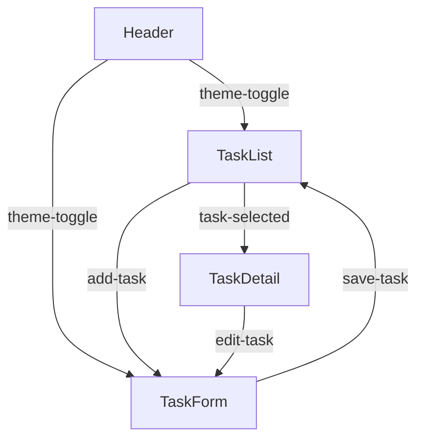
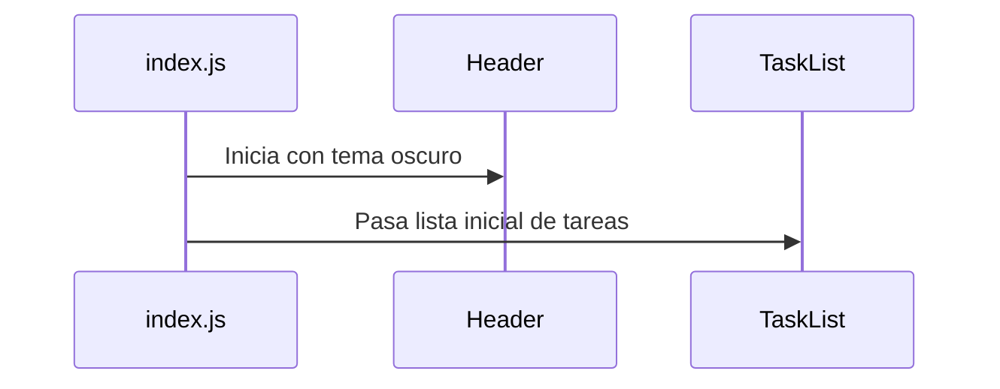
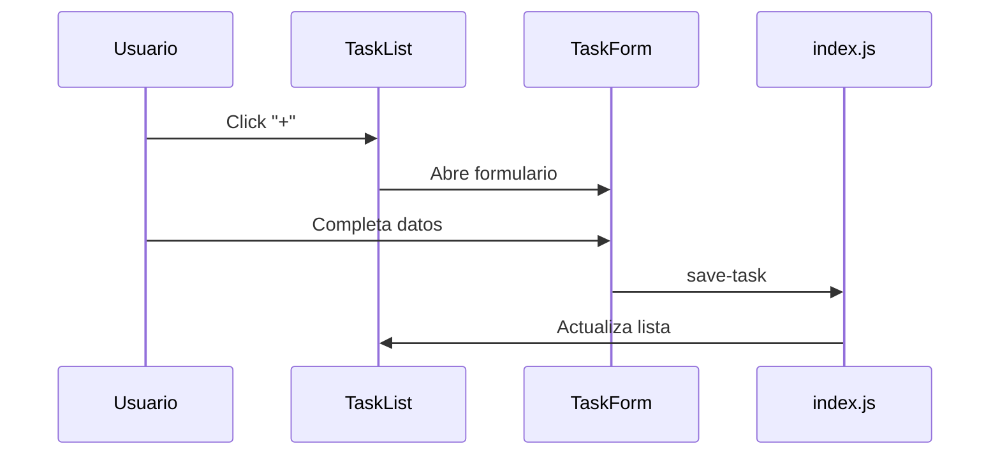
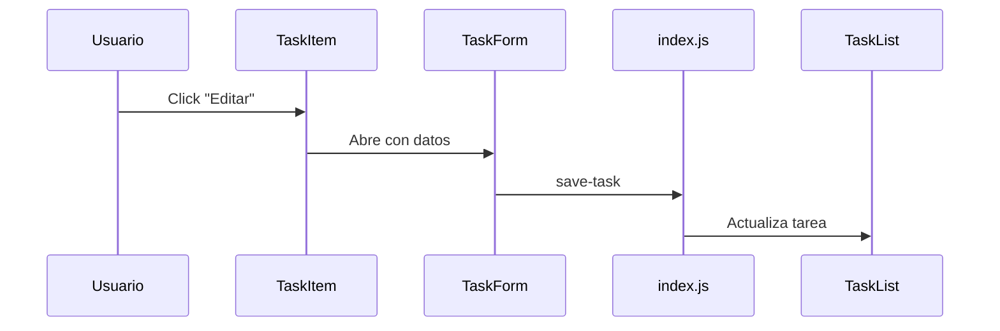

# 🧩 ESPE Task Manager - Web Components

Nombre: Alexander Quizhpe  
Carrera: Tecnologías de la Información

---

Este proyecto implementa una aplicación de lista de tareas utilizando **Web Components personalizados con LitElement**. Está orientado a la modularización, reusabilidad y separación lógica de componentes, ideal para tareas, formularios y navegación.

## Objetivo del Proyecto

Desarrollar componentes web reutilizables que conformen una aplicación de tareas, sin depender de un componente contenedor principal. Cada bloque funcional (encabezado, lista de tareas, formulario, detalles, etc.) es un componente independiente que se comunica por medio de eventos personalizados.

---

## Componentes creados

- `<espe-header>`: Muestra el encabezado, ícono, título y botón de cambio de tema.
- `<espe-task-items>`: Visualiza las tareas individuales
- `<espe-task-list>`: Lista de tareas agrupadas por prioridad o fecha.
- `<espe-task-form>`: Formulario para agregar nuevas tareas.
- `<espe-task-detail>`: Visualiza los detalles de una tarea seleccionada.

---
## Diagrama de Componentes


---
## Flujo de Trabajo Integrado

### 1. Inicialización:

- ``<espe-header>`` carga con el tema predeterminado
- ``<espe-task-list>`` recibe el array inicial de tareas



### 2. Agregar Tarea:

- Usuario hace clic en botón "+" → ``<espe-task-list>`` emite add-task-requested
- ``<espe-task-form>`` se abre en modo creación
- Al guardar, emite save-task con los datos → Actualiza estado en index.js



### 3. Editar Tarea:

- Usuario hace clic en ícono de edición → ``<espe-task-item>`` emite task-edit
- ``<espe-task-form>`` se abre en modo edición con datos precargados
- Al guardar, emite save-task → Actualiza tarea existente



### 4. Ver Detalles:

- Clic en tarea → ``<espe-task-item>`` emite task-selected
- ``<espe-task-detail>`` muestra información completa
- Desde aquí se puede editar o marcar como completada


### 5. Cambiar Vista:

- Pestañas alternan entre orden por fecha o prioridad
- ``<espe-task-list>`` reagrupa las tareas internamente


---
## Documentación Detallada de Componentes

### 1. Componente para el Header ``<espe-header>``
- Barra de navegación superior
- Adaptación responsive
### 2. Componente para los Detalles del Task ``<espe-task-detail>``
- Mostrar información completa de una tarea
- Permitir marcar como completada
- Opción para editar
### 3. Componente para el Formulario del Task ``<espe-task-form>``
- Crear nuevas tareas
- Editar tareas existentes
- Validación de datos
### 4. Componente para los Ítems del Task ``<espe-task-item>``
- Representación visual compacta de tarea
- Acciones rápidas (editar/eliminar)
- Feedback visual de estado
### 5. Componente para Listar y Ordenar los Ítems ``<espe-task-list>``
- Mostrar tareas agrupadas
- Alternar entre vistas (fecha/prioridad)
- Manejar estado vacío

---
## Binding y Comunicación entre Componentes

Se utilizó **data binding unidireccional** y **eventos personalizados** para comunicar cambios entre componentes.

### Ejemplo:

- El componente `<espe-task-form>` emite un evento:
  
  ```js
  this.dispatchEvent(new CustomEvent('task-added', {
    detail: nuevaTarea,
    bubbles: true
  }));
  ```

- El archivo `index.js` escucha el evento y actualiza el estado:

  ```js
  taskForm.addEventListener('task-added', e => {
    tasks.push(e.detail);
    renderTaskList();
  });
  ```

También se usaron propiedades (`.prop` binding) para pasar datos:

```js
taskList.tasks = tasks;
```

---

## Capturas de Pantalla

### Vista general


### Añadir Tareas


### Editar tareas


### Eliminar tareas


### Detalles de las tareas


### Vista de actividad completada


---

## 🐞 Errores Comunes y Soluciones

### ❌ Problema: "Cannot set property 'tasks' of null"

**Causa:** El elemento `<espe-task-list>` no estaba disponible aún al hacer `document.getElementById`.

**Solución:** Asegurarse de que el DOM esté listo usando `window.onload` o mover el script al final del `<body>`.

---

### ❌ Problema: Eventos personalizados no son capturados

**Causa:** Faltaba `bubbles: true` en el evento.

**Solución:**

```js
this.dispatchEvent(new CustomEvent('task-updated', {
  detail: tarea,
  bubbles: true
}));
```

---

### ❌ Estilos no se aplican

**Causa:** Los estilos estaban definidos en el componente padre que fue eliminado (`<espe-app-container>`).

**Solución:** Agregar los estilos globales necesarios en `main.css` y usar `:host` y `:root` en los componentes para mantener la consistencia visual.

---

## Estructura del Proyecto

```
📁 src/
├── components/
│   ├── espe-header.js
│   ├── espe-task-form.js
│   ├── espe-task-items.js
│   ├── espe-task-list.js
│   ├── espe-task-detail.js
├── style/
│   ├── main.js
├── index.js
📁 docs/
│   ├── guia-tecnica.md
└── capturas/
index.html
README.md
```