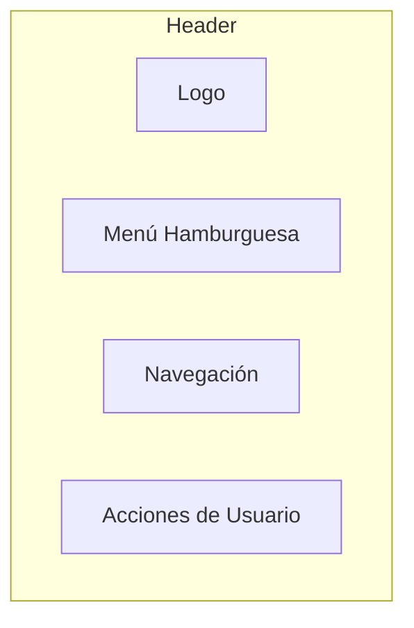
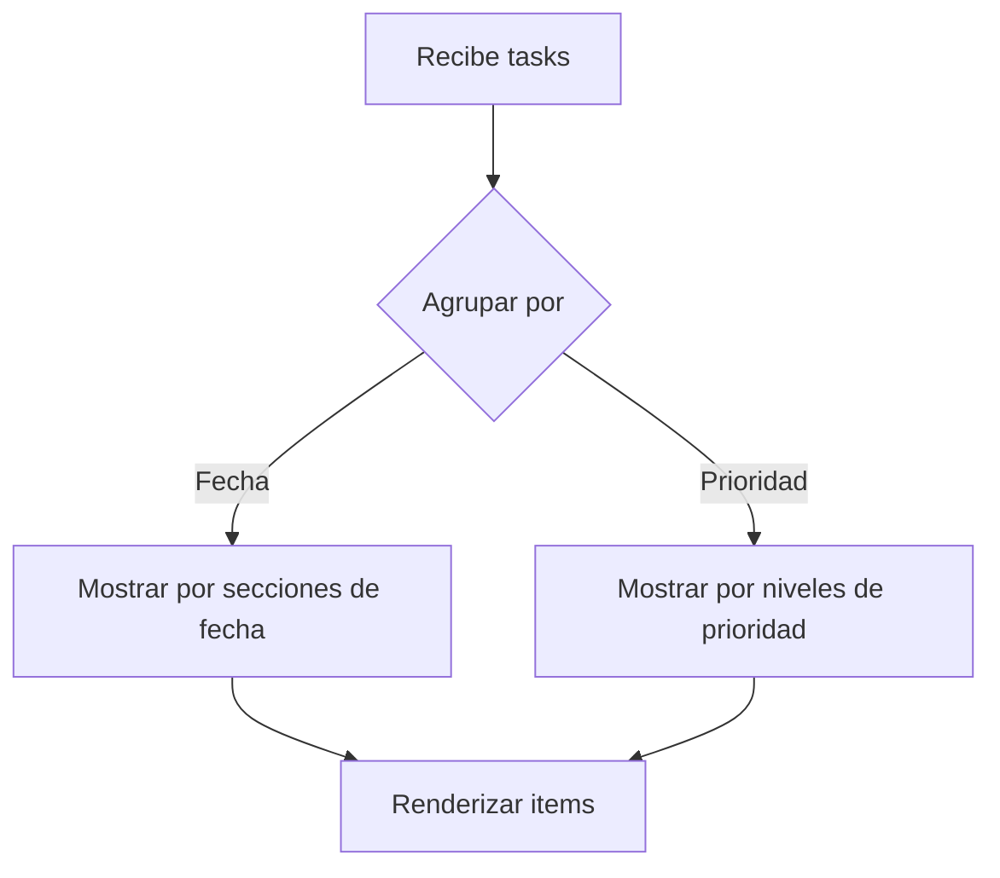
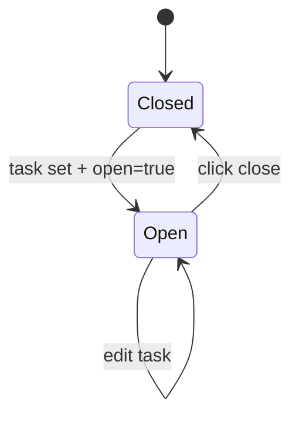
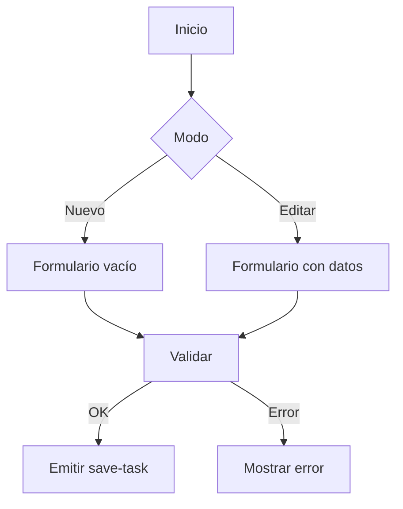
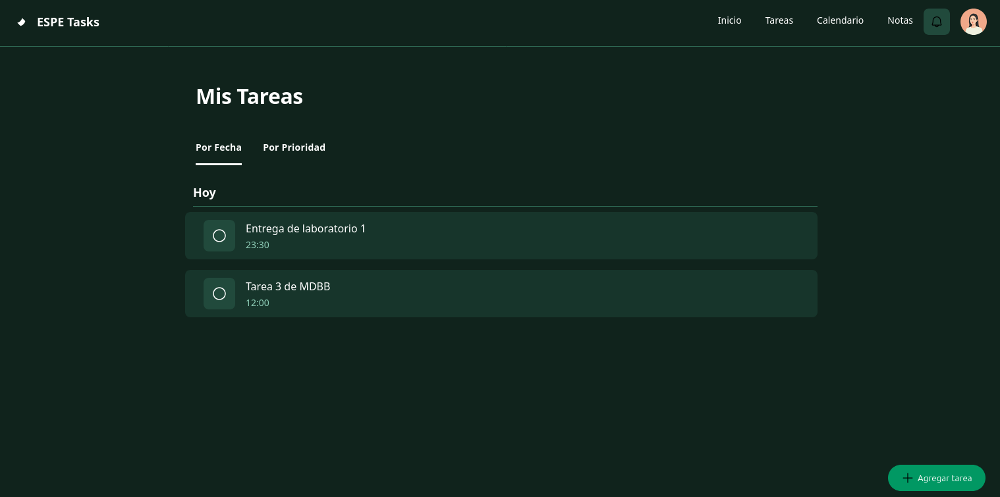
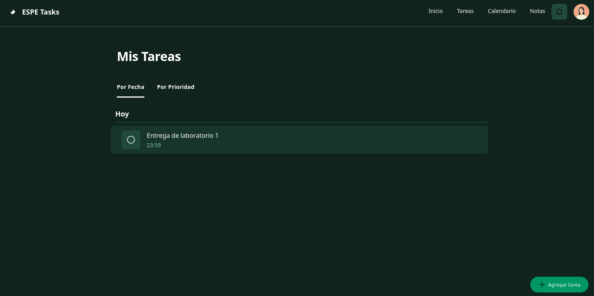
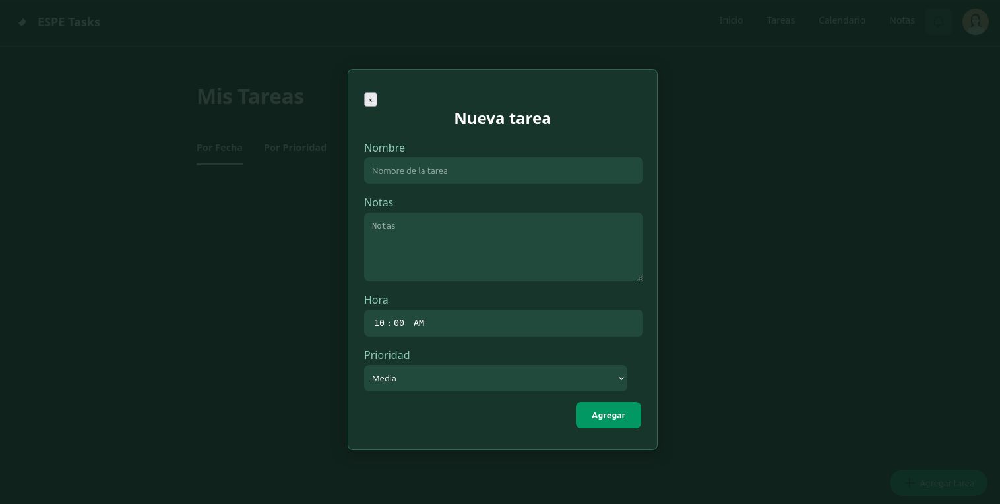
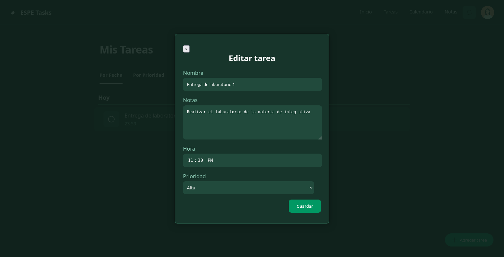
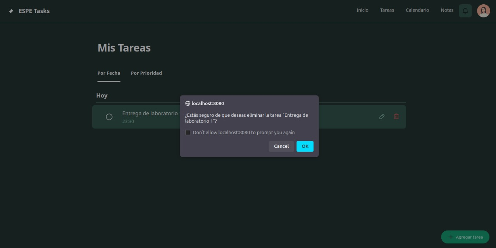
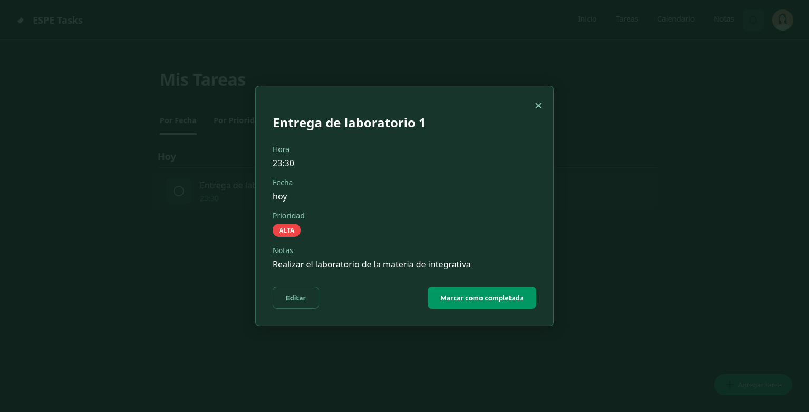

# Task Manager - Web Components con Lit Element

Nombre: Duran Giovanny\
Materia: Programacion Integrativa de Componentes

---

Este proyecto implementa una aplicación de un **To do List** utilizando **Web Components personalizados con LitElement**.

---

## Componentes creados

- `<espe-header>`: Muestra el encabezado, ícono, títulos correspondientes al header.
- `<task-items>`: Visualiza las tareas individuales agregadas, con opciones como editar y borrar las mismas.
- `<task-list>`: Lista de tareas agrupadas por prioridad o fecha.
- `<task-form>`: Formulario para agregar o editar las tareas.
- `<task-detail>`: Visualiza los detalles de una tarea seleccionada.

---

## Documentación Detallada de Componentes

### 1. Componente para el Header ``<espe-header>``
- Barra de navegación superior que contiene el logo, menú principal y acciones de usuario.



### 2. Componente para Listar los Ítems ``<task-list>``
- Lista interactiva de tareas agrupadas por fecha o prioridad.



### 3. Componente para los Ítems ``<task-item>``
- Elemento individual de tarea con acciones e indicadores visuales.

| Propiedad | Tipo | Descripción |
|-----------|------|-------------|
| `task` | Object | Datos de la tarea |

#### Estados Visuales
1. **Normal**: Color completo
2. **Hover**: Muestra acciones
3. **Completado**: Opacidad reducida y tachado

#### Interacciones
- Click: Abre detalle
- Click: Editar
- Click: Eliminar (con confirmación)

#### Diseño Responsive
- Se adapta perfectamente a todos los tamaños de pantalla.

### 4. Componente para los Detalles ``<task-detail>``
- Modal que muestra detalles completos de una tarea.



### 5. Componente para el Formulario ``<task-form>``
- Formulario para crear/editar tareas.



---

## Capturas del Funcionamiento de los componentes

### Vista general Vacia


### Vista general con datos



### Agregar nuevas Tareas


### Editar tareas ingresadas


### Eliminar tareas


### Detalles de las tareas


---

## Estructura del Proyecto

```
📁 src/
├── components/
│   ├── header.js
│   ├── task-form.js
│   ├── task-items.js
│   ├── task-list.js
│   ├── task-detail.js
│   ├── shared-styles.js
├── style/
│   ├── style.js
├── index.js
📁 docs/
│   ├── guia-tecnica.md
└── caps/
index.html
README.md
```